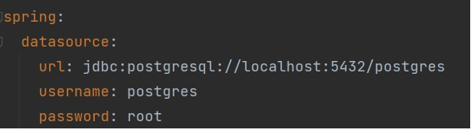
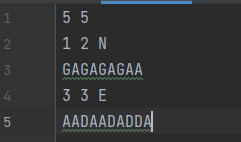
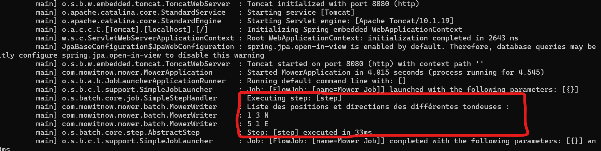

# Prérequis pour lancer l'application :

- JDK version 17 minimum
- Une base de données Postgres ( necessaire pour le stockage des tables Spring batch qui contiennent les informations sur les jobs et les executions )

 Ou

- Docker si vous voulez lancer l'application en mode docker (Optional)

## Configuration de la base de données si vous n'utilisez pas docker

Dans ce cas, vous devez avoir déja installé une base de données postgres, et vous devez modifier les propiètés url, username et password dans
le fichier application.yml

## Packaging de l'application

Pour générer le jar de l'application, il faudra lancer la commande suivante dans le répertoire racine :

./mvnw package

## Lancement de l'application en local ( sans docker )

Dans la racine du projet, lancer la commande suivante :

java -jar ./target/mower-0.0.1-SNAPSHOT.jar

## Lancement de l'application en mode docker

Dans la racine du projet, lancer la commande suivante :

docker-compose up -d --build

## Démarrage du Batch

Le Batch est programmé de telle sorte a être lancé directement après le démarrage de l'application.

## Exemple d'input / output du batch :

Fichier d'entrée

Logs de sortie

 